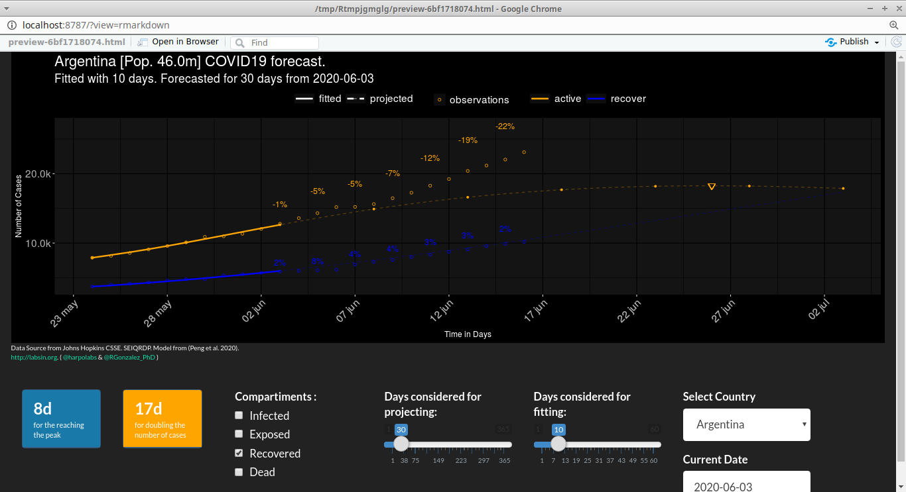

Yet Another SEIQRDP COVID Forecast Shiny App
================

The app
-------

My humble contribution to the COVID-10 forecasting CHAOS. A simple shiny app for forecasting COVID-19 infections

Just another silly shiny app for playing around with COVID19 projections on different countries using the SEIQRDP model from (Peng et al. 2020). Now, you can play with it and impress your Mom and little bro! <https://bit.ly/shinySEIQRDP>

SEIQRDP is a generalization of the SIR model with more compartments such as Exposed, Quarantine and Deads. [RGonzalez\_PhD](https://twitter.com/RGonzalez_PhD) has been testing the model on several countries since the beginning of the Quarantine with pretty decent accurate results. BUT, we are not experts, so... don't take it very seriously..

Some screenshots
----------------

